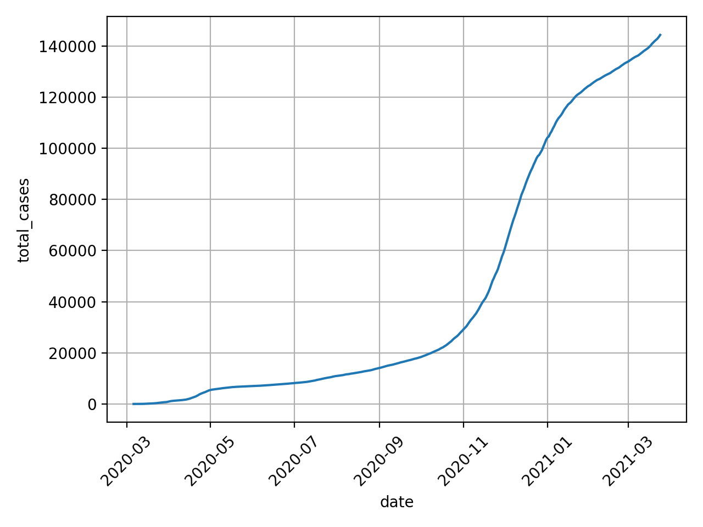
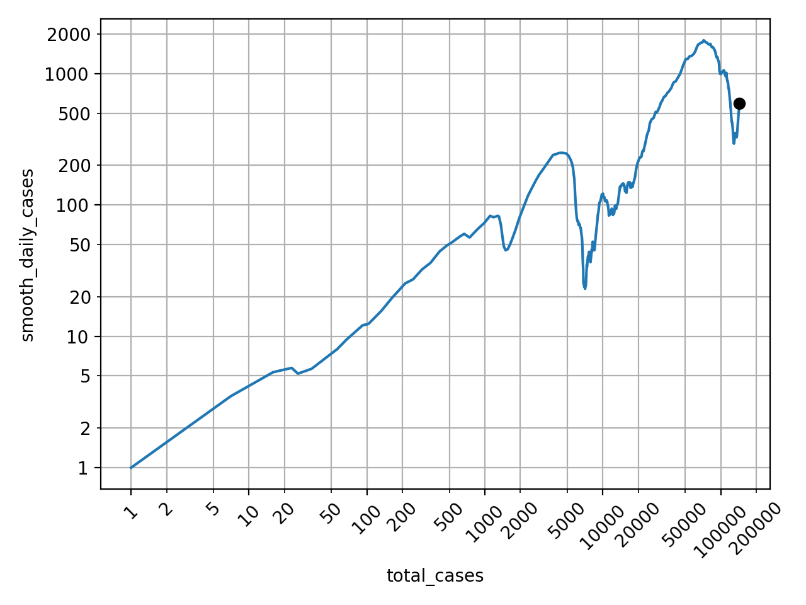

# a5-web_data_to_graph
Create a web application that turns data into graphs.

Author: Ryan Baker

# Problem statement
The goal is to use our skills to build a COVID-19 data visualization.

Let's assume one of your colleagues implemented some prototypes.
In the `data` sub-directory, you will find `measurements.db`, an Sqlite database with daily counts of new infections in Alberta. In the `tools` sub-directory, there are two Python programs that:
- `covid_csv2database.py`: turn a covid19stats.alberta.ca csv file into a Sqlite database
- `covid_plot.py`: read values from Sqlite database and produce plots (see below)

The file `a5-flask_covid_plot.py` contains a Flask server able to read the database, plot daily new infections using Matplotlib/Seaborn and return the plot in png format to the browser.

Based on these prototypes, the goal is to develop a web application:
1. Similar to the route `'/daily'`, add two more routes and view functions:
    - `'/total'`: Total infections as a function of time as a lineplot (see Figure2 in `covid_plot.py`).
    - `'/loglog'`: Log-Log plot of total infections (x-axis) and daily new infections smoothed with moving average (y-axis) (see Figure3 in `covid_plot.py`).
2. Add a root route `'/'` and view function to return an HTML with Flask templates in `templates/index.html` 
3. The template of the root route in `templates/index.html` should contain hyperlinks to reach the three plot routes: `'/daily'`, `'/total'`, `'/loglog'`.
4. (optional) Update `measurements.db` with the latest numbers.
5. (optional) Add a CSS stylesheet.
6. (optional) Add a mechanism for the user to select a date range.
7. (optional) With a route and view to add new, remove existing measurements to/from the database.
8. (optional) With a route and view to view all measurements in table format.

The first two plots, lineplots for daily and total infections, are often seen in the media. The log-log plot is a format to better understand if we reached the hight of a wave, and was proposed in this video [Minutephysics - How To Tell If We're Beating COVID-19](https://www.youtube.com/watch?v=54XLXg4fYsc). Here are plots produced by `tools/covid_plot.py`:

# What to do
Watch the video [Minutephysics - How To Tell If We're Beating COVID-19](https://www.youtube.com/watch?v=54XLXg4fYsc) to learn about the log-log plot and its interpretation. 
Study the code in `tools/covid_plot.py` that implements desired plots reading from a measurement database.

Implement the web application components as outlined by mandatory elements 1. - 3. above by editing the following files in this directory:
- `a5-flask_covid_plot.py`
- `templates/index.html`

Follow the [Style Guide](StyleGuide.md), make sure all files contain your name as author, and use git and github to track your changes.

Edit `README.md` (this file) and include instructions on how to run your program and expected outputs (screenshots) in the _How to run this program_ section below. 

In the section *Reflection*, include what you liked or disliked; found interesting, confusing, challenging, motivating while working on this assignment.

Make sure final version of your code and updated `README.md` with referenced files (screenshots etc.) are committed to git and pushed to github. 

# How to run this program
1. Navigate to the directory where `a5-flask_covid_plot.py` is, and run it.
  - From any internet browser on any device, you can access the site by going to `http://[your computer's IP address]:5000`
  - CSS was added that optimized the page for mobile! Check it out from a mobile device if you have time.
2. Use the navigation menu to see the various graphs served and rendered from the Flask server.

# Reflection
- This was the most fun project yet. It's extremely applicable to a small summer project I will be doing: building a Plotly dashboard for a small contracting company!
- Some students probably finished this project really quickly, but I liked that it was open to 'tinker' with!
